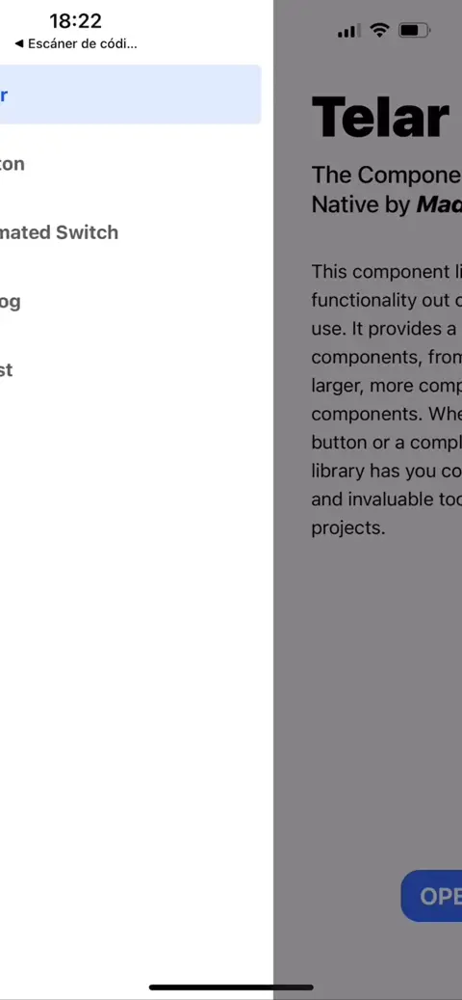

+++
title = 'The 20-hour app'
description = "How I rewrote my first React Native app in 20 hours"
summary = "A rewrite of my first React Native app and a personal take on tooling for prototypes"
resources = ["assets/four days.png"]
keywords = ["App development", "Prototyping", "React Native", "App design"]
date = 2024-10-21T14:09:00+02:00
draft = false
+++

# The context

I recently [wrote about building and publishing an app in 40 hours](https://blog.serchinastico.com/posts/40-hour-app/). In that post, I introduced the concept of [playful programming](https://news.ycombinator.com/item?id=38828766), a new mindset I've recently embraced to rediscover the joy in coding. My latest app, Trufario ([App Store](https://apps.apple.com/us/app/trufario/id6473553839) and [Play Store](https://play.google.com/store/apps/details?id=com.trufario.app)), represents the culmination of countless hours of study and work on React Native. This has brought a lot of memories from when I peeked into this technology that promised to develop for both platforms with a single codebase. 

Back in 2018, I was working at [Karumi](https://www.karumi.com/), a small studio specializing in mobile app development. As part of the team, I juggled between platforms, writing Java/Kotlin for Android and Obj-C/Swift for iOS. You can imagine the mental gymnastics and the many hours I spent switching gears, fighting to understand the differences between interfaces and protocols, the most idiomatic way to implement dependency injection in each platform, and the irks of different rendering systems. React Native promised an escape from this complexity: one ecosystem for both platforms (and hopefully, a farewell to XCode, which still gives me nightmares).

During this time, my then-girlfriend (now wife) was dealing with food intolerances. Her doctor recommended a rotation diet - a simple concept of avoiding repeated ingredients in consecutive meals. To help her manage this challenge, I decided to create an app that would track ingredients and suggest alternatives she hadn't eaten recently. This became my perfect opportunity to dive into React Native, and within a month, the app was live in both stores.

# The original app

I remember struggling with the tiniest things like properly creating reusable components, preventing re-renders, managing global state, etc. I learned so much from that single project, but in particular: 
- [**Sketch**](https://www.sketch.com/) - For everything design related. To test ideas, wireframes and the final designs. Ironically, I later joined their team.
- **Modern Javascript ecosystem** - It wasn't the first time I used it, but it had been a long ago since I did and I had to update myself with the latest ECMAScript features, bundlers, etc. I missed static types so much I switched to Typescript soon after.
- [**React**](https://react.dev/) and [**React Native**](https://reactnative.dev/) - To develop the apps, the many differences with the native components and its abstractions.
- **App stores** - To fill out all the details for a new release, the exam-like review processes, etc.

For an outside viewer, the app was a flop: it had performance issues here and there, limited customization options and a $1.99 price tag on the App Store that didn't reflect its value. To me, though? It was a triumph! I was immensely proud of the achievement: I had single-handedly built a cross-platform app from the ground up (designs, implementation and publication), I did it for two platforms at the same time with little overhead and I found enough people paying for the app to justify the App Store subscription fee of $99/year.

# Homage

For years, I left the app there, paying itself for the subscription. In that time, Despite my growing expertise in React Native, TypeScript, and modern development practices, I couldn't seem to update Four Days. My Git history is littered with abandoned branches `fourdays-ts`, `fourdays-ts2`, `fourdays-rn70`, none of them saw the light of production.

Late in 2023, both app stores **understandably** request an update to support newer OS versions and devices. Unfortunately, I missed the notifications and the app was eventually removed from both platforms. While this might sound strange to you, reader, deep inside me I felt I owned something to the project that brought me into this career path. So, after finishing Trufario, I decided to apply everything I learned to rewrite Four Days.

# The rewrite

Before gettings my hands dirty I decided to define a clear scope of the project, including the following rules:

- **No new designs** - I decided not to re-visit any of the usability and design choices I made in the past. After all, and to my surprise, there is still a small group of people using it and I didn't want to ruin their experience.
- **Feature parity** - The rewrite would not add nor remove any feature of the original app. It would be an updated copy.
- **Backward compatibility** - I would make sure the data stored in previous versions of the app would work with the rewritten version. This one was simple, the app stored all its information locally, using [AsyncStorage](https://docs.expo.dev/versions/latest/sdk/async-storage/) so I just had to make sure both the keys and the data format was the same.

In total, the rewrite took just 20 hours (discounting for store approval and testing times) from creating the repository to having the app published in the stores. Here is a video of the new Four Days:

The feat was only possible because:
- **No switching hats** - Even though I lost the original Sketch designs, I was able to compile the original app and have it in my hands to use it as a reference. That meant there was no context switching to design/product roles, I didn't have to rethink how any of the features worked or what color palette and iconography I wanted to use.
- **Trufario experience** - I was able to dodge many of the rabbit holes I had in Trufario. Why running another lengthy investigation on the most ergonomic global state library? (for me, right now, it's [jotai](https://jotai.org/)). Why spending time on fixing safe area disparities between platforms? Trufario gave me the confidence and the solution to many of the day-to-day problems of developing on React Native.
- **The tooling** - I started (and continue) building a set of tools that'd help me build quick prototypes. This one deserves its own section so keep reading.

# The tooling

After Trufario, I realized how much I enjoyed working on one very specific problem and wondered why it had to be a one-shot. I started envisioning a way to focus on the problem at stake and less on the surroundings (processes, languages, frameworks, libraries, etc). Don't get me wrong, I love solving technical problems but I feel like I tend to fall too often into the technical side of things and forget the original purpose of my deep dives. 

Following the essence of playful programming (meaning to solve my own problems) I created a list of tools, each focused on solving a specific process or problem. Some are being used in all my current and future apps and are evolving quickly, others are still an empty GitHub repository with some issues. They all have silly names, if only, because I didn't want to spend hours in *the surroundings of the surroundings* so I just picked Spanish names for things related to crafts 😅. Here is a tour on the tools I've developed:

- **Telar**, the UI library - React Native doesn't offer a complete set of components for your app. There isn't even a `Button` component (I get why, though). There are plenty of options out there but wanted something I could break and extend for my own apps. Telar uses [Tailwind CSS](https://tailwindcss.com/) + [twrnc](https://github.com/jaredh159/tailwind-react-native-classnames) under the hood and provides a set of reusable themed components that is growing each day. 
 

- **Cepillo**, the utils library - I find myself rewriting the same snippets of code for the most trivial things. From object and array utility functions (`groupBy`, `repeat`, `zip`, `chunkify`, etc) to generating random ids, mathematical usual suspects (e.g. `clamp`, `inRange`) and more.
- **Lutier**, my project assistant - Creating new React Native projects involve all the usual scaffolding: linting, git hooks, npm scripts, Expo integration, code architecture and more. This is all solvable with a project template but I needed something else, something that could be augmented. What if I later realize I need deep links in the app? Or if I want to include in-app purchases, translations or camera permissions? The assistant fills these gaps, it's a CLI tool that helps me progressively add features to my React Native projects.

- **Forja** for meta-programming - While working with Typescript, I found myself in some situations where macros or code-generation tools would have solved the issue at hand more effectively: grouping exports in index files, defining routes, or typing assets, to name a few. These problems involve some sort of repetition that I loathe. After some quick experiments I picked [ts-morph](https://ts-morph.com/). I haven't officially started this project yet but I imagine having a set of scripts/plugins that work with ts-morph and generate Typescript code based on decorators and/or comments.
- **Crisol** for testing - Trufario is tested using two testing techniques I love: [property-based testing](https://en.wikipedia.org/wiki/Software_testing#Property_testing) and [screenshot testing](https://en.wikipedia.org/wiki/Software_testing#Output_comparison_testing). It took me some time to combine the different libraries in a way that felt natural, and specially to make them reliable enough, but I got to a point where this solution can be applied to other apps. I'm particularly proud of the property-based tests where I just send an array of possible commands (e.g. swipe, click, fill an input field, etc) for the runner to execute and then validate that a specific property (e.g. number of items created, navigation constraints, etc) holds true.

# The future of prototypes

If you have reached this far you probably see where this is heading: I've found my place in the world of prototyping and tiny apps. The realization didn't come easily - it took months, maybe even a year, to fully grasp. But now I'm confident this is the path I want to take.

Here is the news: I'm setting up a studio focused on building mobile prototypes. It doesn't have a name, brand or webpage yet, but while I define all of that, maybe you need to validate an idea with real users, or you're seeking investors and want to show them how your project would actually feel. If any of this resonates with you, reach out at prototyping {at} serchinastico {dot} com.