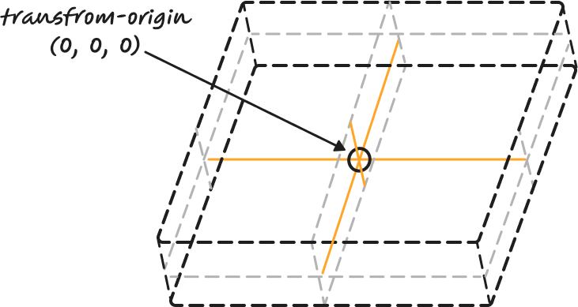
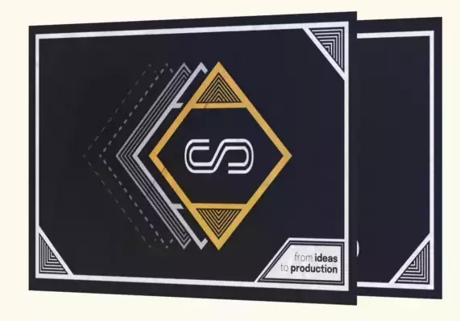
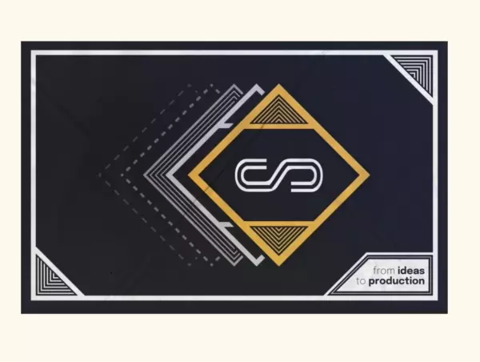

+++
title = '3D business Card in CSS and JS'
description = "Learn how to build a 3D business card with just CSS and JS for your personal webpage"
summary = "Learn how to build a 3D business card with just CSS and JS for your personal webpage. We will learn about CSS transforms and animations, and we will animate it to follow the user's scroll."
resources = ["assets/transform_origin.png"]
keywords = ["CSS", "JavaScript", "Programming"]
date = 2023-09-25T12:23:09+02:00
draft = false
+++

# Intro

In this post I want to talk about how I created the 3D effect on my digital business card. Although you can use this very same technique with any cube-like object, really. I wanted to use a vanilla browser stack so only plain CSS transforms and some basic JavaScript is required.

Without further ado, let’s get into it!

# Building a _cube_ (rectangular cuboid 🤓)

First, we are going to need a base HTML snippet to work with. Here, we will only need 6 elements, each representing one of the 6 faces of the cube.

```html
<div class="scene">
  <div class="card">
    <div class="card-face card-face-front"></div>
    <div class="card-face card-face-back"></div>
    <div class="card-face card-face-right"></div>
    <div class="card-face card-face-left"></div>
    <div class="card-face card-face-top"></div>
    <div class="card-face card-face-bottom"></div>
  </div>
</div>
```

We are going to set some [CSS variables](https://developer.mozilla.org/en-US/docs/Web/CSS/Using_CSS_custom_properties) first defining the size of the box.

```css
:root {
  --card-max-width: 640px;
  --card-max-height: 400px;
  --card-thickness: 10px;
}
```

And then some base CSS for the container nodes.

```css
.scene {
  /* Arbitrary values, just use the ones that better suits your webpage */
  width: 40vw;
  height: 25vw;
  /* First use of the variables, our scene can't be larger than our card */
  max-width: var(--card-max-width);
  max-height: var(--card-max-height);
  /* Small values of perspective makes it look like we are using a fisheye lens
     while large values places the camera far away as if we were using a tele-objective */
  perspective: 4000px;
}

.card {
  max-width: var(--card-max-width);
  max-height: var(--card-max-height);
  position: relative;
  /* Forces child elements (all faces) to be positioned in 3D space */
  transform-style: preserve-3d;
  /* Our first equations! Read below 👇 */
  transform-origin: 
    /* x-offset */ calc(0.5 * var(--card-max-width)) /* y-offset */ calc(
      0.5 * var(--card-max-height)
    )
    /* z-offset */ calc(0.5 * var(--card-thickness));
  /* Just a short transition to make animations smooth */
  transition: transform 0.6s ease-out;
}
```

We can see we are already using our first [`calc`](https://developer.mozilla.org/en-US/docs/Web/CSS/calc) calls here. Remember that we can use them in CSS to perform arithmetic calculations. Even though the operation might be intimidating at first, it’s actually straightforward to see that we are just setting the origin of all transforms right in the middle of the card, in all 3 axis. The idea is that when we rotate the card, it will do so from the center.

<aside>
💡 A note on preference, I like using `0.5 * X` to divide a value by 2 rather than mixing `*` and `/` operators even though they are actually the same.

</aside>



Now let’s see the styles applied to all faces, one by one.

```css
.card-face {
  position: absolute;
}

.card-face-front,
.card-face-back {
  /* Front and back faces just fill the horizontal space */
  width: 100%;
}

.card-face-front {
  /* Move the front card half the thickness up */
  transform: translateZ(calc(0.5 * var(--card-thickness)));
}

.card-face-back {
  transform: 
	  /* Rotate the back card in two axis so that it looks good when fully rotated */ rotateY(
      180deg
    ) rotateZ(180deg) /* Move the back card half the thickness down */
    translateZ(calc(0.5 * var(--card-thickness)));
}
```

We are going to start by placing all faces in absolute positioning. From there, we place the front and back faces in their position, the front one is slightly elevated while the back one is the opposite way from the origin.

The only reason we are rotating the back face twice is because we want it to look straight when we finish its rotation. The following video shows only the front and back faces separated by a long distance to better understand the position of both.



Let’s tweak the left and right faces now!

```css
.card-face-left,
.card-face-right {
  width: var(--card-thickness);
  height: var(--card-max-height);
  /* Position left and right faces at the horizontal center of the cube */
  left: calc(0.5 * (var(--card-max-width) - var(--card-thickness)));
}

.card-face-left {
  /* Left side faces left and is placed at the left end of the cube */
  transform: rotateY(-90deg) translateZ(calc(0.5 * var(--card-max-width)));
}

.card-face-right {
  /* Right side faces right and is placed at the right end of the cube */
  transform: rotateY(90deg) translateZ(calc(0.5 * var(--card-max-width)));
}
```

There is a gotcha here, we are mixing our absolute position (and therefore `left` property) with CSS transforms. The left property is still working in 2 dimensions, placing the faces right in the center of the parent node. Once we got them there, we apply 3D transformations to them and place them at both ends of the cube.

Another interesting thing about the CSS `transform` property, and this applies to other matrix-based transformations I know (i.e. OpenGL) is that order is important. When you apply a rotation and then a translation, you rarely end up in the same state than if you do it the other way around.

Let’s finish with the top and bottom faces. This is just a replica of the left and top faces, changing the reference axis.

```css
.card-face-bottom,
.card-face-top {
  width: var(--card-max-width);
  height: var(--card-thickness);
  /* Position left and right faces at the vertical center of the cube */
  top: calc(0.5 * var(--card-max-height) - 0.5 * var(--card-thickness));
}

.card-face-bottom {
  /* Bottom side faces down and is placed at the bottom of the cube */
  transform: rotateX(-90deg) translateZ(calc(0.5 * var(--card-max-height)));
}

.card-face-top {
  /* Top side faces up and is placed at the bottom of the cube */
  transform: rotateX(90deg) translateZ(calc(0.5 * var(--card-max-height)));
}
```

# Adding some spice

We now have a perfect cuboid in our webpage, but it isn’t very attractive yet, the reason is that we can only see the front face of the box and that’s about it. Let’s make it rotate when the user scrolls the page down.

Because we now want to treat the whole box as a single item, we no longer need to play with faces. Whatever transform we apply now will be to the `card` div instead.

First, I’m going to introduce two of my favourite functions to work with interpolations: [`clamp`](<https://en.wikipedia.org/wiki/Clamping_(graphics)>) and [`lerp`](https://en.wikipedia.org/wiki/Linear_interpolation).

```jsx
/**
 * Clamp restricts a certain value X between a Min and Max values.
 * If X < Min then Min is returned
 * If X > Max then Max is returned
 * Else X is returned
 */
const clamp = (min, max, x) => Math.min(max, Math.max(min, x));
/**
 * Lerp stands for Linear Interpolation. Given two values X and Y
 * and normalized value T between 0 and 1, it returns a value between
 * X and Y that is proportional to the value T.
 * If T < 0 then X is returned
 * If T > 1 then Y is returned
 * Else linear interpolation is returned
 */
const lerp = (x, y, t) => clamp(x, y, x * (1 - t) + y * t);
```

Now for the scroll-rotation code.

```jsx
const SCROLL_UNTIL_FULL_ROTATION_PX = 500;

document.addEventListener("DOMContentLoaded", () => {
  const card = document.querySelector(".card");
  let scrollRotation = 0;

  document.addEventListener("scroll", () => {
    scrollRotation = lerp(
      0,
      180,
      window.scrollY / SCROLL_UNTIL_FULL_ROTATION_PX
    );
    card.style.transform = `rotateX(${scrollRotation}deg)`;
  });
});
```

That’s it. This is how the final card looks like.



# Links

- [Intro to CSS 3D transforms](https://3dtransforms.desandro.com/box) by [Dave DeSandro](https://twitter.com/desandro) - This is the fantastic page that I used for reference to build the first version of the business card.
- [My personal webpage repository](https://github.com/Serchinastico/serchinastico.com) - You probably have noticed the card in my webpage has some other details (like slightly scaling it up and an horizontal rotation when you move your mouse over it). If you want to deep dive, you can read how I made it.
- [Order in CSS transformations – transform functions vs individual transforms](https://www.stefanjudis.com/blog/order-in-css-transformation-transform-functions-vs-individual-transforms) - Interesting article describing in more detail why the order of CSS transformations is important.
- [Codepen](https://codepen.io/Serchinastico/pen/qBLxaLB) - Here is a codepen with the source code from this post for you to play, copy or whatever you want to do with it. Little nitpick, I included some other elements like background colors, texts and so to make it usable.
