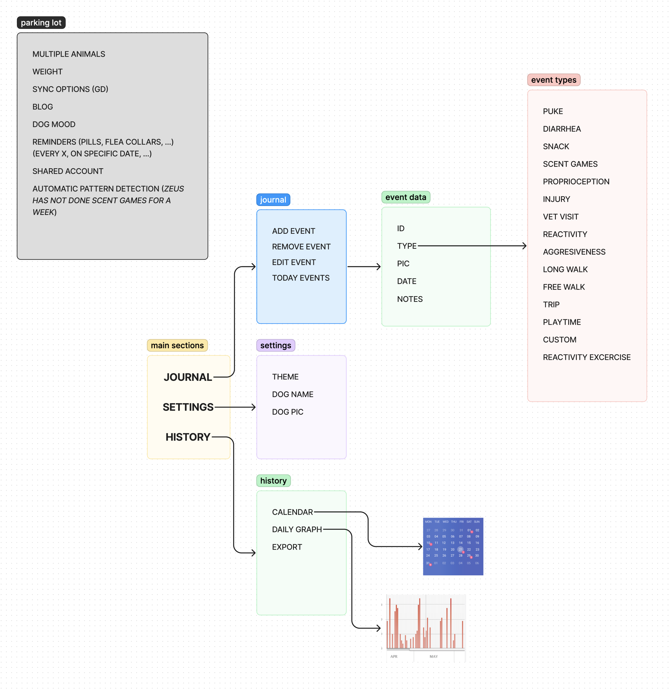
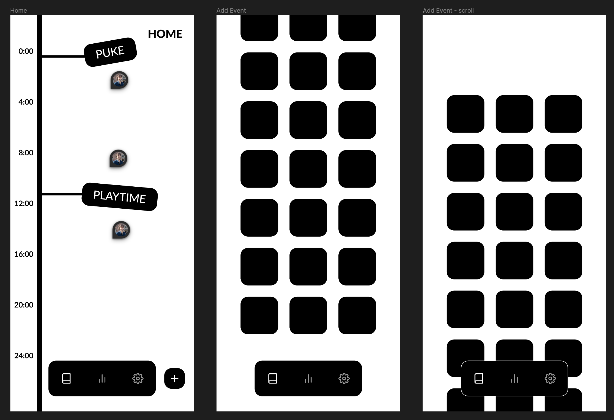
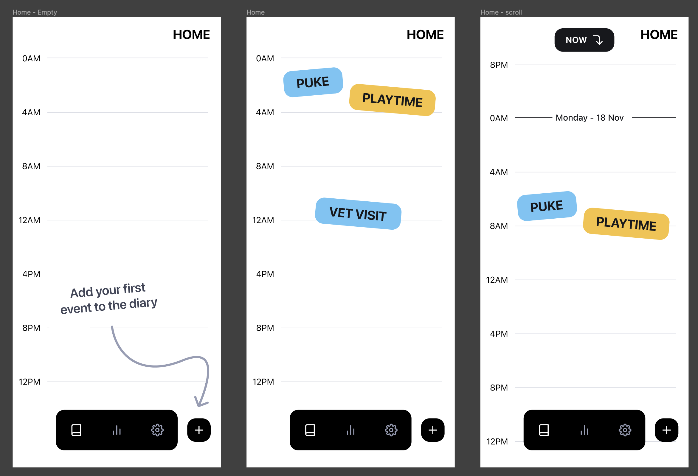

+++
title = 'The 40 hour app'
description = "My progress on publishing an app in 40 hours for both Android and iOS"
summary = "Dive into the process I followed to create a new app from the gound up for both Android and iOS and publish it in the stores."
resources = ["assets/trufario.png"]
keywords = ["App development", "Prototyping"]
date = 2024-08-28T14:09:00+02:00
draft = false
+++

# The problem

I have a big, reactive dog. He is the most adorable potato at home, but when we go on walks, there are certain triggers that will make him bark. A lot. Besides training with a professional, I wanted a way to keep track of the dog's most important events or activities to help me find links and ways to improve our life together. I know it sounds counter-intuitive, but being a tech-person, I tried finding a non-app solution. It didn’t work. I tried and discarded the following tools:

1. **My memory**: Probably the least reliable method. If [negativity bias](https://en.wikipedia.org/wiki/Negativity_bias) and [recency bias](https://en.wikipedia.org/wiki/Recency_bias) weren’t enough, I also have a pretty bad memory.
2. **A notebook**: I couldn’t keep up with the habit of sitting after each walk and write down what happened. Also, once the data was in written format, it’s very hard to process.
3. **Notion page**: Data can be processed but… I had the same problem than the notebook, I found it really hard to create the habit of tracking everything.

# The plan

The more I thought about it, the more convinced I was to create an app. But I didn’t want to spend a lot of time on it, so no new technologies, no fancy UIs, just something to solve my problem and my problem only (others referred to this as [_playful programming_](https://news.ycombinator.com/item?id=38828766) which is a term I love). I started by drafting my main goals:

1. To make it really easy to get my phone mid-walk and record something that happened, or I’m doing, with my dog.
2. To be able to export all the data I collect in a format suitable for further processing.
3. To focus only on me and my dog’s problem.
4. To build it fast.

After some consideration I asked myself: Why keeping it to myself? I’m pretty sure more people must be going through the same, so I included a 5th goal:

5. To publish it.

# The execution

I started painting some screens and navigating the problem space, discovering the right information hierarchy that worked for me.

I wanted to keep the project light and fun, so I didn't run a full exploration. My focus was not on finding the best way to represent events or deciding which icons I would use. Instead, I focused on having a good enough overall design. In other words, I aimed to find the first idea that was consistent and usable.

Once I determined the number of screens, user interactions, and overall design, I decided to add some personality. However, I didn't conduct thorough research to find a color that wasn't used by any competitor or define all the states of every button. My priority was to test the concept early rather than following all the steps in the book to create a design system.

With the most basic designs in hand, I jumped right into Expo + React Native. I won't go into nitty details but I implemented almost everything in just a couple afternoons. There were some divergences from the designs here and there but I didn’t bother keeping them in sync, I knew that woulndn't get me closer to publishing the app.

On the 40th hour, the app was published in both, the [App Store](https://apps.apple.com/dk/app/trufario/id6473553839) and [Google's Play Store](https://play.google.com/store/apps/details?id=com.trufario.app&hl=es_419). The app is missing many features: 

- It does not store data on any server, so if you delete the app, your data will be lost. 
- It only displays a chart to identify potential relationships, but requires you to download all the data to delve deeper.
- It doesn't allow you to create new customized events or include a start/end times for a given event.

Despite the limitations, it perfectly suits my use case and, to me, there is no better solution.

[VIDEO]

# The pains

- **Switching hats**: I had to switch roles frequently. Building things fast meant making mistakes. Lots of them. There was a *constant* struggle to keep everything synchronized that lasted just a day. Even so, I had to make numerous small decisions, and constantly switch between design and implementation, which ended up being both fun and exhausting.
- **Play Store requirements**: I always feared publishing anything in the App Store. There are a lot of requirements and the app has to be manually reviewed by someone in their team and it’s not uncommon for your app to be rejected. I thought Google’s Play Store was more lenient, but I was so wrong. As of November of 2023, Google changed [their policies](https://support.google.com/googleplay/android-developer/answer/14151465?hl=en) to force personal accounts to run a closed beta with 20 testers for 14 days. For indie developers like me, finding 20 voluntaries to test the app was a true challenge (❤️ a huge thank you to all volunteers that came from https://guauful.com/ to test the app ❤️).
- **Saying no (or later)**: To my surprise, there was a lot of interest in my app from testers. They provided invaluable feedback and ideas for improvement. However, I had to repeatedly prioritize and focus on solving my own problems before considering others'. I had to decline many interesting proposals. If this is seen as selfishness, it is because it is. But I also believe it has been a great way to test the plan, learn how to stay focused, and finish something.

# The take-aways

- I found that leaving easy tasks for the next day helped a lot. Instead of becoming frustrated because I couldn’t solve something, I chose to do the opposite - leave a partially solved problem for the next day. When I returned to it, I felt ecstatic to finish what I had left unfinished. This approach may not work for everyone, and its effectiveness can depend on the context. However, for  this project, it proved to be a great way to avoid [gumption traps](https://en.wikipedia.org/wiki/Zen_and_the_Art_of_Motorcycle_Maintenance#Gumption_traps).
- Finally, I’m going to reveal the big secret (you probably guessed it by now). It’s true it took me 40h to publish the app, but that doesn’t mean it took me a week of work. The reality is that work spanned for over ~3 weeks. Working few hours each day gave me truly interesting results:
    - **Focus**: While working on the app, I found myself truly focused at the task at hand, even the ones I didn’t truly enjoyed. Some call this to be [in the zone](https://en.wikipedia.org/wiki/Flow_(psychology)) and it has been extremely rare for me in the last year or so but with this project I was constantly *flowing*.
    - [**Red work - Blue work**](https://chemaclass.com/blog/red-work-blue-work/): Having long pauses between work times allowed for my mind to explore alternatives, solutions and problems without me putting much effort into it.
    - **Satisfaction**: Putting life (e.g. appointments, vet visits, playing guitar etc) before work made the entire thing truly satisfying.

# The app

