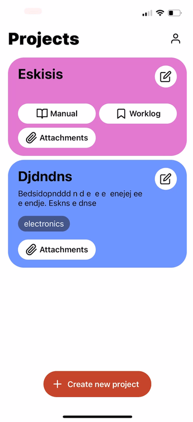

+++
title = 'The 80-hour app'
description = "Building an app in 80 hours to keep up with your DIY projects"
summary = "The third app in the series and how I built it in React Native"
resources = ["assets/dim.png"]
keywords = ["App development", "Prototyping", "React Native", "App design"]
date = 2024-12-17T09:00:00+02:00
draft = false
+++

# The context

Here we go again! This is the 3rd in a series of my adventures building React Native apps. In [part 1](https://blog.serchinastico.com/posts/40-hour-app/) I shared my dog-habits tracker, while in [part 2](https://blog.serchinastico.com/posts/20-hour-app/) I talked about the redesign of my first personal app, a rotation diet assistant. I tried really hard for this project to be the 10-hour app, but things got messy very quickly and ended up building the most challenging app I've worked on so far. Without further ado, let me share with you the post-mortem of my longest (and most fun) project so far: **Do It Myself**.

# The struggle

I'm a curious person, and as such, I have many hobbies. They mostly revolve around expressing myself in some way: woodworking, 3d printing, creative coding, pen plotting, etc. I keep many projects alive at the same time and switch between them often. As you'd expect, this usually leads to chaos, and while I can survive it, it's far from ideal.

I've been able to keep my sanity mainly thanks to these two tools:

1. **Saved messages in Telegram**. There is a nice feature in Telegram I (ab)used for years: sending messages to yourself. These messages are great as reminders, personal notes and, in my case, as references and worklogs for my projects. My personal chat is filled with images, videos recordings and keywords to search for specific projects.

1. **My own manuals and personal notes**. I epecially use this for my woodworking projects. Before starting a new project, I design it in a 3D program and then write a fully fledged manual including materials, dimensions, joints and details. This helps me anticipate the problems I might encounter and plan for them. At the end of the project, I tape the manual somewhere in the piece for future reference.

Foto de un manual
{.todo}

# Pragmatics

At a certain point, I decided to improve my planning and put my React Native skills to use. I spent a couple of hours in my product hat synthesizing my thoughts, finding the most ergonomic way to address the problem, and reading the responses I received from the poll I posted (thanks to everyone who participated ❤️). From this phase, I came up with some ideas that I'm including here:

- I need a way to structure the app into different projects.
- Projects should be searchable - tags? free-form text description?
- The main components of projects are attachments: mostly images and videos.
- Projects might include multiple phases, each with its own associated tools, and some tools may be used throughout the entire project duration.
- A manual is usually created at the beginning of the project, but it can be expanded with implementation insights or unplanned issues later down the line.
- For someone who frequently switches between projects, I need somewhere to write down what I did in my last session - this helps me catch up next time, let's call it a worklog.
- While implementing something I usually have to change a measurement to make it all work after an unexpected change. Wouldn't it be cool if the project updated related values accordingly? Dimension variables can be a thing.
- Some projects (like mounting and dismounting a cabinet) do not require anything other than a few pictures to see where every screw goes.

From there, I jumped into visualizing how some of these ideas and concepts worked together. You can ignore the name of the app and the Splash screen font, as by the time I was working on it I was engrossed in [Mr. Robot](https://www.imdb.com/title/tt4158110) 😅.

Apologies for the notes in Spanish 🙏.
{.imgfootnote}

I've already mentioned it elsewhere, but there is a rush in building something so quickly. It's so much fun and a way of flowing I truly enjoy. At the same time, I'm fully aware this is a road to massive disappointment: things do not completely fit together, there is a lack of cohesion, and the usability of the app may be hurt. Because of this, I often builds apps mixing these two types of work - one after another. I start by just letting myself *feel* the vibes and see where they lead me. Right after that, I switch roles and I review all the work to the tiniest detail, this is the boring, heavy administrative (ish) work that has to be done.

# Aesthetics

After having a basic idea of the information I wanted to include in the app, I began to think about how I'd like it to look. I ran explorations of the home screen, trying to focus in both the hierarchy of the different entities and how they worked together, all while testing visual elements like colors, shadows, rounding, strikethroughs, etc., with the intention to find a combination that supported the app's purpose and language.

I chose the second option and decided to design some other screens as well. This helped me visualize how these elements worked on other scenarios. I had to tweak some values here and there but I was quite satisfied with the results. I even borrowed the "marker" detail from another exploration and used it here.

I continued in this direction and managed to paint 80% of the app. Some of the decisions here are implicit and some I will discover during implementation. I have to keep in mind that I'm both producing and consuming the designs, so things like error messages, loading states, icons/illustrations coherence, scrolling or even copies were given far less attention in this phase. However, I still spent some time in the following points:

- Keeping a clean design file, using variables and basic components
- Ensuring there was enough contrast for texts and colors (aiming for AAA).
- Creating as few text styles as possible. I managed to use only 3 headers, body, caption, and button styles.
- Exploring some interesting cases like no projects, no tags, multi-line titles, confirmation dialogs, etc.

# Engineering

All these efforts on the design and product side of the app made the implementation so much easier.

## Tooling

I won't go into every nitty detail of the code but I'd like to share with you some of my go-to libraries and tools - apart from the big ones from Expo - that have saved me so much time.
- [flash-list](https://shopify.github.io/flash-list/) - Shopify's performant replacement for FlatLists. It's been a long time since the last time I used FlatLists on any project.
- [jotai](https://jotai.org/) - Jotai is by far the simplest library to deal with state management in React (Native). Combine it with [AsyncStorage](https://docs.expo.dev/versions/latest/sdk/async-storage/) or [mmkv](https://github.com/mrousavy/react-native-mmkv) and you have persistent state in just a dozen lines of code.
- [fuse-js](https://www.fusejs.io/) - Lightweight fuzzy search for every platform. I don't conceive any search component that doesn't use this under the hood. It's been a while since the last update but you know what they say, if it works, don't touch it.
- [twrnc](https://github.com/jaredh159/tailwind-react-native-classnames) - Tailwind, but for React Native. Extensible with your own classes and modifieds. Nothing else.
- [lingui](https://lingui.dev/) - A great offline tool for i18n. It uses standard translation files (`.po`) and supports pluralization.
- [10tap](https://10play.github.io/10tap-editor/docs/intro) - For the rich text editor. I considered other alternatives like [Gutenberg](https://github.com/WordPress/gutenberg) by the WordPress team but wanted to go for a simpler look.

Just to give you an idea, this is what I had in 12 hours of coding. Already had a list of projects and a base editor I could work with.
{.imgfootnote}

## Chasing rabbits

It's time to talk about the elephant in the room, my nemesis during this project, the component that took most of the 80 hours of work: the rich text editor. If you've read so far, you probably noticed how little time I dedicated to this feature, often dismissing it with the thought that *there is probably a package that already solves this for me*. The good news is there is such package, many of them actually: [10tap](https://10play.github.io/10tap-editor/docs/intro.html), [react-native-cn-quill](https://github.com/imnapo/react-native-cn-quill) and [Gutenberg](https://github.com/WordPress/gutenberg) among others. All these solutions have something in common: they create a webview component and use a web tool to deal with text edition ([tiptap](https://tiptap.dev/), [quill](https://quilljs.com/), etc).

I started playing with 10tap and soon I realized I needed to understand the web component to fully unlock its capabilities. I know some of you sense where all this is going and what I had to learn the hard way: __text editors are hard__, even more so in apps with mixed technologies. I set a goal: create a header with the project color and the marker style. I read all 10tap docs that then directed me to the web tool it uses under the hood: Tiptap. The I realized Tiptap was only but a wrapper around [ProseMirror](https://prosemirror.net/) and, before I realized, I had custom scripts to build my own version of the web editor, injected themed CSS, bridged messages between the web editor and the react native app, etc. I felt lost many times, I questioned every single decision that led me deeper into the rabbit hole, tested and re-tested the other libraries and even doubted if I even needed an editor at all. I ended up persevering and I'm quite happy with the result. Not only I was able to create custom headers, but also was able to include local images, presented in a grid, and even created my own version of voice messages.

App video
{.todo}

## Closing the project

With the editor harnessed, I dedicated the remaining time on adding the usual niceties:

- **Light/Dark themes** - Thanks to **twrnc** and a good color palette this took just a couple hours to do.
- **Haptic feedback** - Buttons, alerts, etc. I love it when an app gives you a little nudge to let you know something is important. And for those who don't want it, there is an option in the app settings to disabled them.
- **Illustrations** - I needed a set of illustrations to add on the coherence of the app. If you are a terrible illustrator like me, you may want to visit [ui8](https://ui8.net/) to purchase sets of assets for your app (no affiliation with them whatsoever, I'm sure there are alternatives out there and if you know of any, I'd love to hear).
- **Animations** - I love to pair user actions with short, to the point, animations.
- **In-app purchases** - I decided to let everyone use the app with all its features, **up to 3 projects**. As with the other apps, I try to find problems that do not require a backend. That way, I can charge customers with a single payment rather than a subscription.
- **Cloud backups** - I included the possibility to back all projects in your personal Apple Cloud or Google Cloud account.

# Did it myself!

The app is now available in the Apple Store and it's in the process of the internal review process in Android (the infamous ~~20~~ 12 testers in 14 days rule).

Include links
{.todo}

I will now start the process of improving [my own tooling](https://blog.serchinastico.com/posts/20-hour-app/#the-tooling) with what I learnt from **Do It Myself**. I'll add components, capabilities and much more. 

In the meantime, I'm working on creating a studio that focuses on building mobile prototypes. If you need help building something quickly to test your ideas, or you are seeking investors just let me know at prototyping@serchinastico.com.