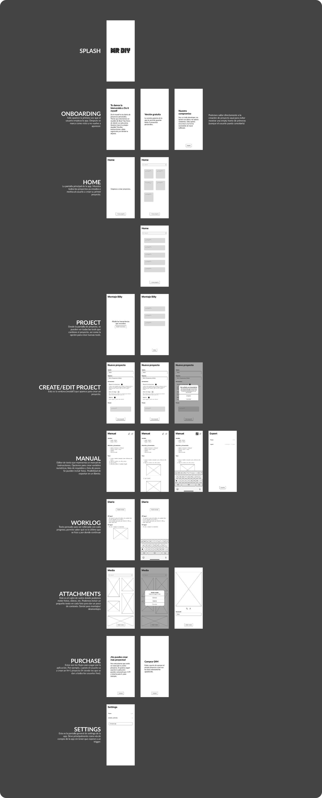

+++
title = 'The 80-hour app'
description = "Building an app in 80 hours to keep up with your DIY projects"
summary = "The third app in the series and how I built it in React Native"
resources = ["assets/dim.png"]
keywords = ["App development", "Prototyping", "React Native", "App design"]
date = 2024-12-17T09:00:00+02:00
draft = true
+++

# The context

Here we go again! This is the 3rd in a series of my experience building React Native apps. In [part 1](https://blog.serchinastico.com/posts/40-hour-app/) I presented my dog-habits tracker, while in [part 2](https://blog.serchinastico.com/posts/20-hour-app/) I talked about the re-design of my first personal app, a rotation diet assistant. I tried so hard for this project to be the 10-hour app, but things got messy very quickly and I ended up building the hardest app I've worked on so far. Without further ado, I'd like to share with you the post-mortem of my longest (and most fun) project so far: **Do It Myself**.

# The pain

I'm a curious person, and as such, I have many hobbies. They mostly revolve around expressing myself somehow: woodworking, 3d printing, creative coding, pen plotting, etc. I keep many projects alive at the same time and switch between them, often. As you may expect, the process ensures chaos, and while I can survive it, it's far from ideal.

I've been able to keep my sanity mainly thanks to these two tools:

1. **Saved messages in Telegram**. There is a nice feature in Telegram I (ab)used for years: the possibility to send messages to yourself. These messages can be serve as reminders, personal notes and, in my case, as project references and worklogs. My personal chat is filled with images, videos and voice notes + keywords to be able to search for specific terms.

2. **My own manuals and personal notes**. Specially for my woodworking projects, I start by designing my pieces in a 3d program to then proceed to write a fully fledged manual including materials, dimensions, joints and details. This gives me an idea of the problems I'll find and plan for them. At the end of the project, I tape the manual somewhere in the piece for future reference.

[[FOTO DE MANUAL]]

# Pragmatics

At some point, I decided to see if I could improve my planning and put my React Native skills to use.

I spent a couple hours with my product-hat synthesizing my thoughts, finding the most ergonomic way to solve the problem and reading the responses I received from the poll I posted (thanks to everyone who participated ❤️). From that phase, I ended up with some ideas I'm including here:
- I need to be able to structure the app into projects.
- Projects have to be searchable - tags? free-form text description?.
- The main component of projects are attachments: mostly images and videos.
- Projects may have multiple phases, each phase has different associated tools, and some tools may live for the entire duration of the project.
- A manual is a tool that is usually created at the beginning of the project, but it can be expanded with implementation insights or unplanned issues.
- For someone who changes projects many times, I need somewhere to write what I did on the last session to catch-up next time, let's call it a worklog.
- While implementing something I usually have to change a measurement to make it all work after an unexpected change. Wouldn't it be cool if the project updated related values accordingly? Dimension variables can be a thing.
- Some projects (like mounting and dismounting a cabinet) do not require anything other than a few pictures to see where every screw goes.

From there, I jumped into visualizing how some of these ideas and concepts played together. You can ignore the name of the app and the Splash screen font, by the time I was working on it I was finishing [Mr. Robot](https://www.imdb.com/title/tt4158110) I was obsessed with it 😅

I already talked about it in other posts but there is a rush in building something so quickly, it's so much fun and a way of flowing I truly enjoy. At the same time, I'm fully aware this is a road to massive disappointment: things do not completely fit together, there is a lack of cohesion, and the usability of the app may be hurt. That's why I now often mix the two types of work, one after the other. I start by playing notes, letting myself *feel* the vibes and seeing where it guides me. Right after that, I switch roles and I review all the work to the tiniest detail, this is the boring, heavy administration-ish work that has to be done.

# Aesthetics

After having a basic idea of the information I wanted to include in the app, I jumped into thinking how I'd like it to look. I ran an exploration of the home screen, trying to focus in both the hierarchy of the different entities and how they played together, all while testing visual elements that could fit the purpose of the app and supported it. I tried colors, shadows, rounding, strikethroughs and more, the purpose of this phase is to build a coherent language.

I chose the 2nd option and decided to design some other screens to see how the screen elements applied to other scenarios. I had to tweak some values here and there but I was satisfied with the result. I even picked the "marker" detail from a different exploration and used it here.

I continued in this direction and managed to paint 80% of the app. Some of the decisions here are implicit and some I will discover while implementing the app. I have to keep in mind this is not a regular day-to-day handover (I'm both the produced and consumer of the designs) so things like error messages, loading states, icons/illustrations coherence, scrolling or even copies are partially ignored in this phase. I run some explorations here and there if I find like it and it's worth the time. On the other hand, I spent some time in the following points:
- Keeping a clean design file, using variables and basic components
- Making sure there is enough contrast for texts and colors, looking for AAA
- Creating as few text styles as possible, I managed to use only 3 headers, body, caption and button styles.
- Exploring some interesting cases like no-projects, no-tags, multi-line titles, confirmation dialogs, etc.

# Engineering

All these efforts on the design and product side of the app made the implementation of the app much much easier. I won't go into every nitty detail of the code but I'd like to share with you some of my go-to libraries and tools - apart from the big ones from Expo - that have saved me so much time.
- **flash-list** - Shopify's performant replacement for FlatLists. It's been a long time since the last time I used FlatLists on any project.
- **jotai** - Jotai is by far the simplest library to deal with state management in React (Native). Combine it with [AsyncStorage](https://docs.expo.dev/versions/latest/sdk/async-storage/) or [mmkv](https://github.com/mrousavy/react-native-mmkv) and you have persistent state in just a dozen lines of code.
- **fuse-js** - Lightweight fuzzy search for every platform. I don't conceive any search component that doesn't use this under the hood. It's been a while since the last update but you know what they say, if it works, don't touch it.
- **twrnc** - Tailwind, but for React Native. Extensible with your own classes and modifieds. Nothing else.
- **lingui** - A great offline tool for i18n. It uses standard translation files (`.po`) and supports pluralization.
- **10tap** - For the rich text editor. I considered other alternatives like [Gutenberg](https://github.com/WordPress/gutenberg) by the WordPress team but wanted to go for a simpler approach.

Just to give you an idea, this is what I had in 12 hours of coding:

