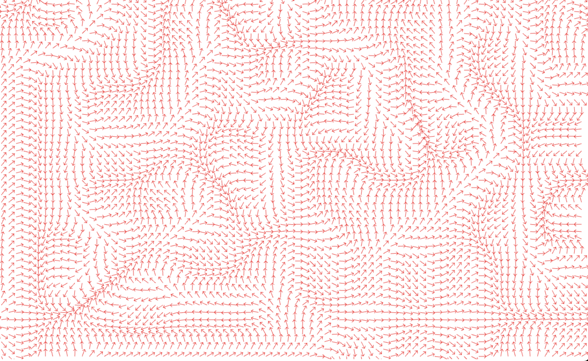
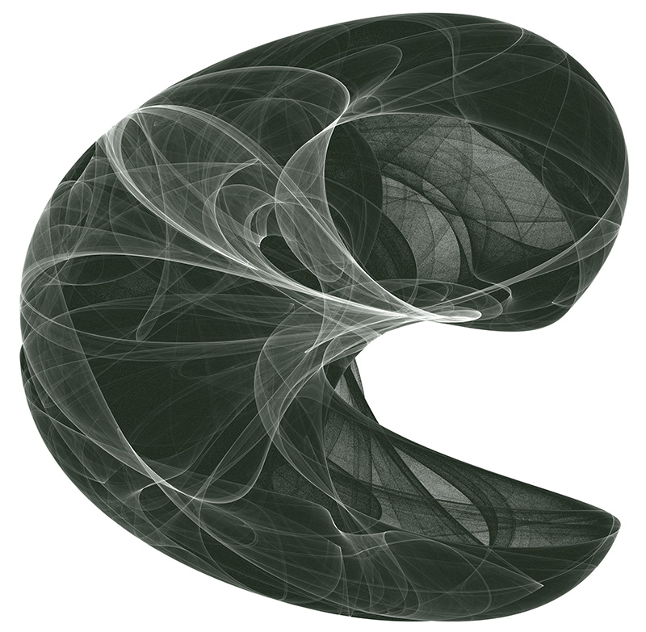
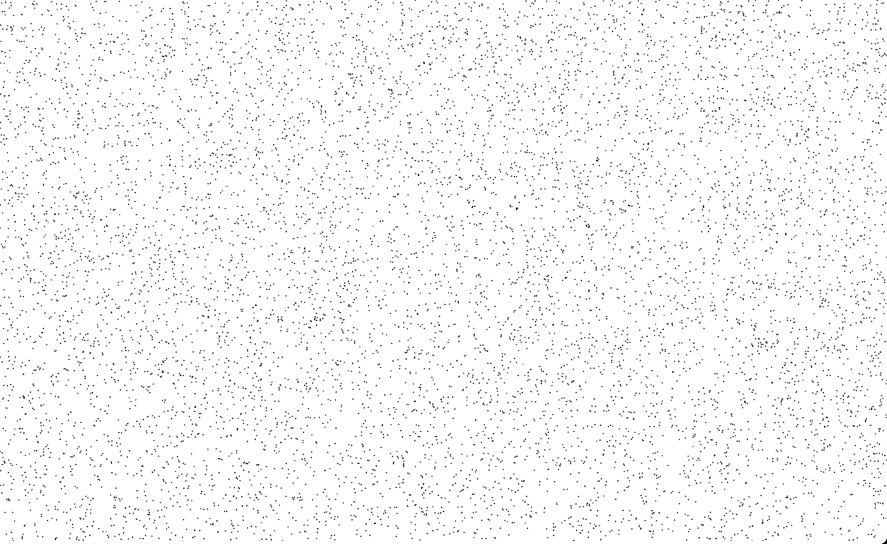
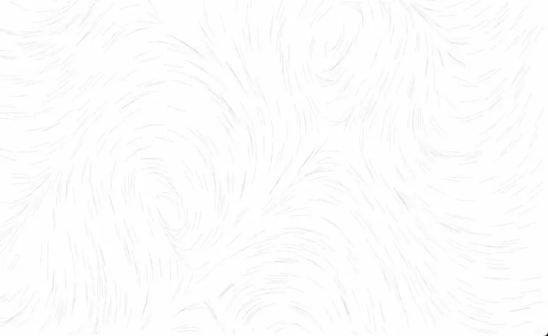
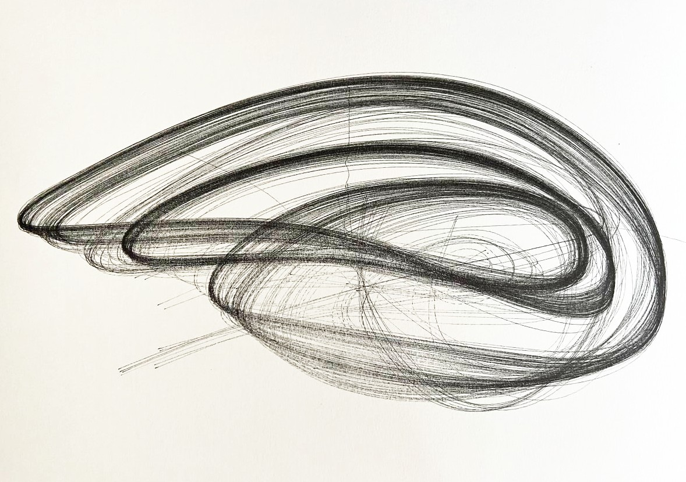
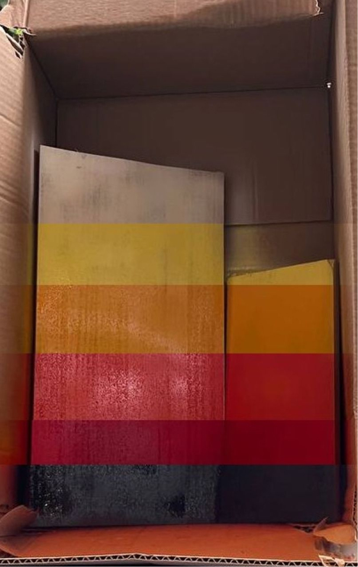
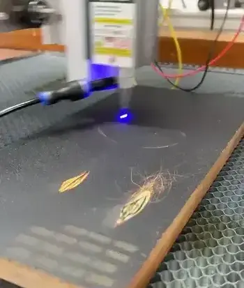
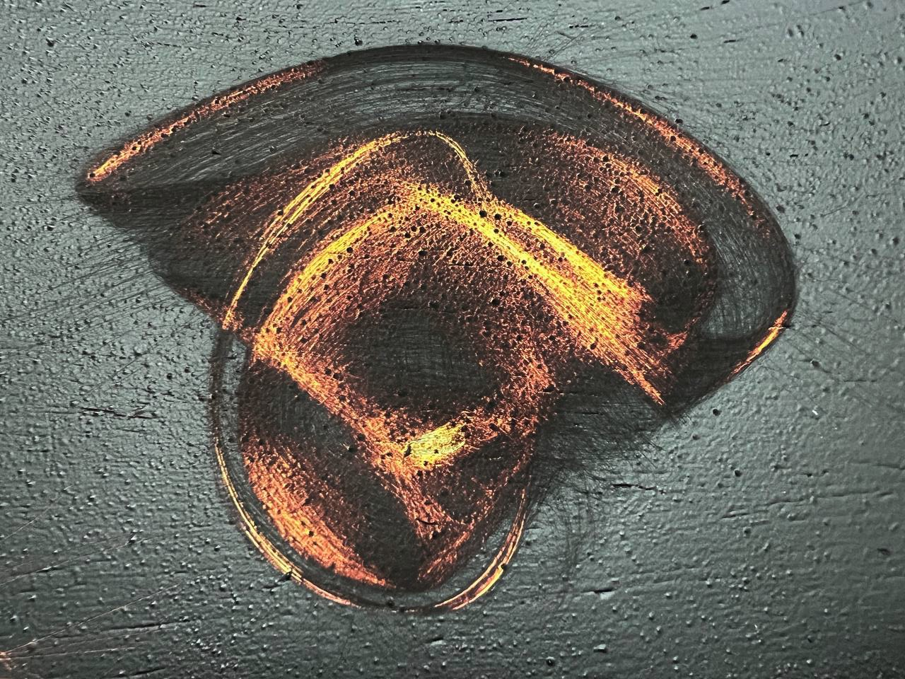

+++
title = 'Intro to flow fields'
description = "Let's see how to translate the theory from flow fields to amazing visual creations that can be devirtualized with a CNC."
summary = "Let's see how to translate the theory from vector fields to amazing visual creations that can be devirtualized with a CNC."
resources = ["assets/vector_field.png"]
keywords = ["CSS", "JavaScript", "Programming", "Generative Art"]
date = 2023-10-25T10:30:09+02:00
draft = false
+++

# The theory

I spent the last week playing with a physical concept that fascinates me and is widely used in the generative art world: [flow fields](https://en.wikipedia.org/wiki/Vector_field) (a.k.a. vector fields).

Simply put, a flow field is nothing but a lot of arrows thrown in a plane. If we want to be more technical, a flow field is a function that returns a vector for every point in the space.



Flow fields have a variety of uses, from modelling wind, magnetic or gravitational forces to solving pathfinding in video-games (specifically the ones that use voxels, where A\* is far from optimal).

For generative purposes, there are many ways you can define such a field, you can use [perlin-noise](https://en.wikipedia.org/wiki/Perlin_noise) or [image gradients](https://en.wikipedia.org/wiki/Image_gradient). For these cases, you just have to find a way to transform these black and white representations to vectors. For this post, I will use [Peter de Jong Attractors](https://paulbourke.net/fractals/peterdejong/). When used in flow fields, attractors are functions that tend to move particles traveling the field to a stable state, no matter where they start.



> _Credit to Paul Burke for this the beautiful visualization of a Peter de Jong Attractor_

# The simulation

Let’s move onto creating beautiful visuals with flow fields. Again, there are many ways we can approach the simulation but in this post I’ll focus on simulating particles in a 2D field. In order to do that, we will use a canvas node, create an array of particles - randomly distributed in the canvas - and draw them.

```html
<html>
  <head>
    <!-- metas, imports, etc -->
  </head>
  <body>
    <canvas id="canvas"></canvas>
  </body>
</html>
```

```js
// Get the canvas and its context to draw things on it
const canvas = document.querySelector("#canvas");
const context = canvas.getContext("2d");

// Make the canvas fill the whole screen
canvas.width = window.innerWidth;
canvas.height = window.innerHeight;

// Create and place 1000 particles randomly in the canvas with no velocity
const particles = [];
for (let i = 0; i < 1000; i += 1) {
  particles.push({
    x: Math.random() * window.innerWidth,
    y: Math.random() * window.innerHeight,
    vx: 0,
    vy: 0,
  });
}

// Render
context.fillStyle = "#000";
particles.forEach((particle) => {
  context.beginPath();
  context.arc(particle.x, particle.y, 1, 0, 2 * Math.PI);
  context.fill();
});

/*
 * WIP Simulation (keep reading! 👇)
 */
```



> _Slowly getting there, a thousand particles ready to be in motion_

Once that’s done, we will start moving the particles following the flow field direction. For each particle, we get the vector in its position, move the particle following that vector and draw a line from the previous position of the particle, to the new one. We are adding some code to account for velocity, friction and so on, in order to make the simulation more physically accurate.

```js
context.lineWidth = 0.1;

const render = () => {
  particles.forEach((particle) => {
    context.beginPath();
    context.moveTo(particle.x, particle.y);

    // Get the vector at the particle position
    const { force, angle } = getFlowFieldVector(particle.x, particle.y);

    // Update the particle velocity following the vector
    particle.vx += Math.cos(angle) * force;
    particle.vy += Math.sin(angle) * force;

    // Move the particle according to its velocity
    particle.x += particle.vx;
    particle.y += particle.vy;

    // Render the particle movement as a line
    context.lineTo(particle.x, particle.y);
    context.stroke();

    // Apply friction, reducing velocity to control that particles do not fly away
    particle.vx *= 0.95;
    particle.vy *= 0.95;

    // Wrap around the edges
    if (particle.x < 0) particle.x = window.innerWidth;
    if (particle.x > window.innerWidth) particle.x = 0;
    if (particle.y < 0) particle.y = window.innerHeight;
    if (particle.y > window.innerHeight) particle.y = 0;
  });

  requestAnimationFrame(render);
};

requestAnimationFrame(render);
```

We define the flow field function using a de Jong Attractor:

```js
const a = Math.random() * 8 - 4;
const b = Math.random() * 8 - 4;
const c = Math.random() * 8 - 4;
const d = Math.random() * 8 - 4;

const getFlowFieldVector = (x, y) => {
  // Scale down x and y
  x = (x - window.innerWidth / 2) * 0.005;
  y = (y - window.innerHeight / 2) * 0.005;

  // The attactor returns a new x, y from the old one
  // Here we are using Johnny Svensson's variation
  const newX = d * Math.sin(a * y) - Math.sin(b * x);
  const newY = c * Math.cos(a * x) + Math.cos(b * y);

  // Get the vector from the old position to the new one
  // and return the vector attributes as force (magnitude) + angle (in radians)
  const vector = { x: newX - x, y: newY - y };
  return {
    force: Math.sqrt(vector.x * vector.x + vector.y * vector.y),
    angle: Math.atan2(vector.y, vector.x),
  };
};
```



With this, we have the core of our simulation working. If you want to continue improving how it looks, you have an endless number of ways to do this, here are some ideas:

- **Color gradients** - You can make particles change color with each simulation step, or change the color depending on how many particles travelled over a coordinate. You can pick gradients from [Coolors](https://coolors.co/) and use a library like [Chroma.js](https://gka.github.io/chroma.js/) to define gradients.
- **Particle size** - Why use a single particle size when you can play with it? Make particles grow in size when they are faster, younger or any other property you want.
- **Particle recreation** - Once you play with flow fields for a while you will see some particles find a stable spot and stop contributing to the visuals. You can find particles that stopped moving and place them in a random spot again. Or why do we wrap the space? Once a particle leaves the screen we can recreate it somewhere else.
- **Dimensions** - To make things simple we only represented the field in 2D space, but there is so much more you can do with these functions. You can simulate particles in a three dimensional space, or even better, account for time and make the flow field function slightly change over time.

# The real world

Finally, let’s make this nice visualisation tangible! To me this is the most exciting (and sometimes frustrating) part of the process and the one with the hardest/more creative problems. Now we could just print the graphic in our classic printer but that wouldn’t be much fun. Instead, we’ll transform our simulation into something we can feed a [CNC](https://en.wikipedia.org/wiki/Numerical_control).

I use my CNC with two different tool heads nowadays: a pen plotter and a laser. We are going to use the first one to create a small piece of art.

In order to do that, we need a way to transform the particle paths into [G-code](https://en.wikipedia.org/wiki/G-code) (which is one of the many formats CNC usually understand). Unfortunately, our HTML canvas does not know anything about G-code, but it does know about [SVG](https://en.wikipedia.org/wiki/SVG), which is a vector-based graphics format that can be easily transformed into robotic movements!

Now, if you try to transform our simulation into SVG directly you will notice that our output files are huge. That’s where libraries like [simplify-path](https://github.com/mattdesl/simplify-path) and [fit-curve](https://github.com/soswow/fit-curve) appear. The first one immensely reduces the number of intermediate points in our simulation and the second one finds [bezier curves](https://en.wikipedia.org/wiki/B%C3%A9zier_curve) to fit the paths (and therefore smooths the resulting line).

```js
const paths = [];
particles.forEach((particle) => {
  paths.push([]);

  // Simulate 1000 ticks in total
  for (let step = 0; step < 1000; step++) {
    // Simulate particle as we just did in the render function
    paths.push([{ x: particle.x, y: particle.y }]);
  }
});

// Simplify and smooth the resulting paths
const smoothedPaths = paths
  .map((path) => simplify(path, 10))
  .map((path) =>
    fitCurve(
      path.map((p) => [p.x, p.y]),
      200
    )
  );

// Poor man's SVG export
let svg = `<svg width="${config.width}" height="${config.height}" xmlns="http://www.w3.org/2000/svg">\n`;
for (const path of curvePaths) {
  const firstCurve = path[0];

  svg += `\t<path stroke-width="0.1" d="M ${firstCurve[0][0]} ${firstCurve[0][1]} `;
  for (const curve of path) {
    svg += `C ${curve[1][0]} ${curve[1][1]}, ${curve[2][0]} ${curve[2][1]}, ${curve[3][0]} ${curve[3][1]} `;
  }
  svg += `" stroke="black" fill="none" />\n`;
}
svg += `</svg>`;
```

The resulting SVG is quite big, but still manageable. With it, I used [DrawingBot](https://drawingbotv3.com/) to transform the SVG into G-Code and fed it into the CNC. Here is the result with a field flow of only 200 particles (imagine one with thousands!)



# The bloopers

I also tried using the laser in a more creative way. I covered a piece of wood with many layers of paint, creating a fire-like gradient, to later use the laser to peel off the layers.

| gradient                               | engraving                             | result                            |
| -------------------------------------- | ------------------------------------- | --------------------------------- |
|  |  |  |

This worked moderately well in small tests but when I tried porting it to a bigger piece, it wouldn't work.

# References

- [My take on flow fields on a web browser](https://flowfields.serchinastico.com/) - My own implementation of flow fields, it has many visualization options (the ones I personally wanted to research).
- [The repository for flowfields.serchinastico.com](https://github.com/Serchinastico/flow-fields) - It’s open source! Fork it and make your own rules.
- [OpenSimplex noise](https://en.wikipedia.org/wiki/OpenSimplex_noise)
- [Flow Fields, Part 1](https://medium.com/@bit101/flow-fields-part-i-3ebebc688fd8), [Flow Fields, Part 2](https://medium.com/@bit101/flow-fields-part-ii-f3c24c1b777d) and [Strange Attractors Flow Fields](https://www.bit-101.com/blog/2021/10/strange-attractor-flow-fields/) - Bit101 (or Keith Peters) has been my greatest inspiration to start playing with flow fields. I could say this blogpost is mostly his work with me notes. He has a ton of fantastic blog posts if you want to go deeper into this topic.
